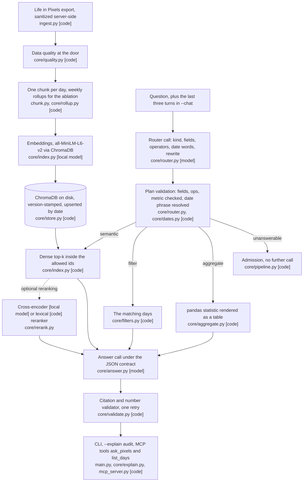

# Behavioral Data RAG

[](https://github.com/SamieVargas/pixels-rag/actions/workflows/tests.yml)

A RAG pipeline for asking natural language questions over six months of
structured daily behavioral and biometric data, mine, from Life in Pixels:
questions a spreadsheet can't answer, with the answer's dates checked in code.
Runs on the machine that holds the data, as a CLI or as a local MCP server.

## Problem

A spreadsheet filters one column. The questions I wanted to ask cut across
many fields at once: *"On days with low body battery, what else was true?"*,
*"What exercise types correlate with better sleep scores?"*. v1 answered them
by retrieving the most similar days and letting the model synthesize, which
worked, and which could not say whether retrieval was any good, whether the
citations were real, or what happened to "what was my average sleep on hot
yoga days", which no amount of similarity search answers correctly. The
finding this project has been quoted on, that hot yoga plus walking beat
everything else for sleep and recovery, came from asking the model.

v2 adds the three missing things: a router that sends each question to
retrieval, to a filter, to a pandas aggregate or to an admission; an answer
contract whose citations are enforced in code rather than asked for; and a
dated golden set with results tables, so every number below points at a
file in `evals/results/`. The headline finding is now also computed from the
day records with a bootstrap interval, so the model's version can be checked
against it.

## Architecture



Three kinds of box. `[code]` is deterministic, runs in Python and is tested
without a model. `[model]` is a call to `claude-haiku-4-5-20251001` (the id
is one constant in `core/contracts.py`; the reasons are in
`docs/decisions.md`). `[local model]` is a model that runs on the machine
and sends nothing anywhere: the embedder and the cross-encoder. The model
is called for the router, for the answer, and for the follow-up rewrite,
which rides on the router call as one of its fields rather than being a
separate call.

### Ingest, chunks and the index

The data source sanitizes records server-side before anything leaves it, so
free-text fields never reach this client; the pipeline only ever sees the
structured, sanitized export. `ingest.py` fetches it with `requests` and a
token, `chunk.py` turns each day's row into one information-dense text
chunk, and `core/index.py` embeds the chunks locally with ChromaDB's default
model (`sentence-transformers/all-MiniLM-L6-v2`, no API cost, good enough for
a corpus of a few hundred rows) into a store on disk.

**Data quality at the door** `[code]`. Every ingest validates the rows first
and writes the report to `evals/results/ingest-<date>.md`. A duplicate date,
or a date that does not parse, fails the ingest before anything is written.
Missing days in the range, values outside each field's range (a sleep score
of 140, a resting heart rate of 20), and days whose chunk holds nothing
beyond the date and the rating are warnings, counted in the report and
listed by day. `--stats` shows the same report without touching the index.
On the fixture the report is clean apart from its five deliberately unlogged
days.

**An index that stays current** `[code]`. v1 was a one-shot export.
`python main.py --since 2026-08-01` reads the days logged since a date and
upserts them by `id = date`, so running it twice leaves the same index, and
an edited day replaces its chunk in place. The collection records the chunk
template version, a hash of `chunk.py`, and the embedding model that built
it; when the code disagrees with any of the three, the next ingest rebuilds
the whole index and says why, rather than mixing two chunk formats in one
store. `python main.py --status` prints the newest indexed day, the newest
day at the source, how many logged days the index is behind, and the version
stamp. A living index is the difference between a demo and a tool you open
on a Tuesday.

**Rollups** `[code]`. `core/rollup.py` computes one deterministic chunk per
week beside the day chunks, tagged `level: week`. They exist for the chunking
ablation below (arm B) and are not in the default index.

### The router

```
question
  └─ router · one Haiku call under a JSON Schema · kind, fields, operators, the date words   [model]
       ├─ semantic      dense search over day chunks, restricted to the days the filters and dates allow   [code]
       ├─ filter        the matching days, decided in code; the model summarizes them   [code, then model]
       ├─ aggregate     pandas computes the statistic; the model narrates the table and nothing else   [code, then model]
       └─ unanswerable  an admission, no model call   [code]
```

The model does the part that needs language and code does the part that
needs to be right. The router's reply is a plan, and `resolve()` in
`core/router.py` validates it in code before anything runs: a field that is
not in the field list is dropped and named in the plan's notes, an unknown
operator likewise, a non-numeric aggregate metric is refused, a filter
question with no filters left falls back to semantic search, and a reply
that is not JSON degrades to semantic search with the parse error kept.
Relative dates never reach the model as a problem to solve: the router
copies the date words from the question ("the first two weeks of June",
"last two weeks") and `core/dates.py` resolves them against the newest
logged day, so a question means the same thing on every run. Filters run in
`core/filters.py` over the day records, and the dense search is told which
ids it may return. An aggregate question never touches the index. Every
query logs its route.

### The answer contract

```jsonc
{ "answer": "string",
  "claims": [ { "text": "string", "dates": ["YYYY-MM-DD"] } ],
  "cited_dates": ["YYYY-MM-DD"],
  "unanswerable": false,
  "why_unanswerable": "string or null" }
```

The prompt asks for citations `[model]`; `core/validate.py` enforces them
`[code]`. A cited date has to be one the pipeline retrieved. A claim has to
name at least one date unless the answer is an admission. Every number in
the answer has to appear in a cited day's text, in the question, or in the
computed table, because numbers are what the model is most tempted to
invent about a time series. A failure goes back to the model once, with the
violations as the next user turn, and the CLI prints the
retrieved-but-uncited and cited-but-unretrieved counts on every answer.
Structured output (`output_config.format` with the schema) is the default
contract; `--contract prompt` runs the same shape through the prompt and the
fence-stripping parser in `core/parse.py`, and the pipeline records which
path handled each reply. The evidence sent to the answer call is capped at
30 chunks.

### Reranking

`--rerank cross-encoder` retrieves the top 20 and lets a local cross-encoder
(MS MARCO MiniLM from sentence-transformers, nothing leaves the machine)
`[local model]` keep the top k. `--rerank lexical` is a token-overlap
baseline that needs no model `[code]`, there so the wiring can be tested and
run anywhere. Both are off by default; the measurement is under Evals.

### The embedding model, decided with data and with a privacy line

`core/embeddings.py` holds three local arms (`minilm`, the default;
`bge-small`; `e5-small`) and one API arm (`openai`, `text-embedding-3-small`).
The `openai` arm sends every chunk's text to OpenAI, which is why it is off
unless asked for by name with `OPENAI_API_KEY` set, and why the default stays
local whatever its number turns out to be. Arms that cannot run say so in
the table rather than failing the run.

### Follow-ups and query rewriting

`python main.py --chat` keeps the last three turns `[code]`. Before anything
is retrieved, the router sees them and rewrites a follow-up ("and on hot yoga
days?", "only in June?") into a standalone question `[model]`, which is the
`rewritten_query` field of its contract; the filters, dates and aggregate
spec are filled as if the full question had been asked, and then validated
like any other plan.

### The headline finding, reproduced deterministically

`python analysis/recovery.py` `[code]` computes the hot yoga plus walking
claim from the day records instead of asking: mean sleep score and body
battery on the habit's days against all other days, n per group, a seeded
bootstrap interval on the difference, and the same the morning after. The
fixture plants that pattern, so on the fixture the table confirms the code
rather than the finding; the real-data table is
`python analysis/recovery.py --days chroma_db/days.json` and lands beside the
eval results. Where the model's answer and this table agree, the story is
that the model surfaced it and the aggregation confirmed it. Where they
disagree, that is the better story, and the reason aggregation questions
are routed away from retrieval.

### A local MCP server

`mcp_server.py` exposes two read-only tools over stdio, `ask_pixels(question)`
and `list_days(start, end)`, through the same router, validator and model
call the CLI uses. The tool schemas are code `[code]`; `ask_pixels` makes the
same two model calls as the CLI `[model]`. Claude Desktop or Claude Code can
ask the data questions while the data stays on the machine; a question sends
its evidence to the model provider exactly as the CLI does, and `list_days`
sends nothing anywhere and is capped at 100 days. There are no write tools.
Add it to Claude Desktop with:

```json
{"mcpServers": {"pixels": {"command": "python", "args": ["/path/to/pixels-rag/mcp_server.py"],
                           "env": {"PIXELS_DB": "/path/to/pixels-rag/chroma_db", "ANTHROPIC_API_KEY": "..."}}}}
```

### What leaves the machine

`docs/PRIVACY.md` is one page: the data stays in the local ChromaDB; a
question sends only the retrieved day chunks, or the computed table, to the
model provider; the logs carry dates, scores, routes and usage and never the
text; the embedding API arm is off by default and says what it sends.
`python main.py --explain "..."` prints, for each retrieved chunk, its
score, which filters matched, whether it sat in the date range and whether
the answer cited it, with the route, the resolved plan and the validator's
outcome, so any answer can be audited in ten seconds.

## How to run

```bash
pip install -r requirements.txt
cp .env.example .env   # then fill in PIXELS_URL, PIXELS_TOKEN, ANTHROPIC_API_KEY
```

The commands that matter:

```bash
python main.py --source fixture --rebuild           # index the synthetic days, no credentials needed
python main.py --rebuild                             # your export, via .env (run this first, and whenever data changes)
python main.py "Did I sleep better on hot yoga days?"
python main.py "Which days was my sleep score under 60?"
python main.py --rebuild "What does recovery look like after trail running?"   # rebuild and ask in one shot
python main.py --since 2026-08-01                    # upsert the days logged since a date, idempotent
python main.py --status                              # how far behind the source the index is, no model calls
python main.py --chat                                # a conversation; follow-ups are rewritten from the last three turns
python main.py --explain "..."                       # the audit view, per retrieved chunk
```

The no-credit path, for inspecting before you spend anything:

```bash
python main.py --dry-run   # show the first 3 chunks, verify chunking, no API calls
python main.py --stats     # date range, avg rating, missing-days count and the quality report, no API calls
```

| Flag | Description |
| --- | --- |
| `--rebuild` | Re-fetch data and rebuild the index |
| `--source live\|fixture` | The live export, or the committed synthetic days (default: live) |
| `--db PATH` | Index directory (default: `./chroma_db`) |
| `--days N` | Days of history to fetch (default: 180) |
| `--top-k N` | Days to retrieve per query (default: 8) |
| `--contract native\|prompt` | Structured output, or the prompt and the parser (default: native) |
| `--rerank none\|lexical\|cross-encoder` | Retrieve 20 and rerank to top-k (default: none) |
| `--chat` | A conversation with the last three turns kept |
| `--explain` | Per retrieved chunk: score, filters matched, route |
| `--json` | Print the full result as JSON |
| `--since YYYY-MM-DD` | Upsert the days logged since this date |
| `--status` | How current the index is, no model calls |
| `--dry-run` | Show the first 3 chunks, no API calls |
| `--stats` | Corpus stats and the quality report, no API calls |
| `--v1` | The v1 path: top-k and a prompt-only citation request, on the same index |

Example questions:

```bash
python main.py "What exercise types correlate with higher sleep scores?"
python main.py "On low energy days, what else was typically true?"
python main.py "What patterns appear on my highest-rated days?"
python main.py "How does sleep quality relate to next-day productivity?"
python main.py "What does my sleep look like when body battery is below 20?"
python main.py "What's different about my 5-star days vs my 1-2 star days?"
```

## Evals

`evals/golden.jsonl` holds 28 questions across the four kinds, written on
2026-09-22 before any retrieval run: seven semantic, seven filter, seven
aggregate, five unanswerable, plus two follow-ups that carry their prior
turn. They are written against `fixtures/days.json`, a seeded synthetic
export with the real export's shape and a few planted days, since the real
data stays off the repo (see `docs/decisions.md`). The filter and aggregate
labels are computed by plain Python in `evals/make_golden.py` that does not
import the pipeline, and a test checks the pipeline against them.

The metrics. **Route accuracy** is the router's kind equal to the golden
kind. **Recall@k** is the share of a question's expected dates covered by the
top k retrieved chunks (a week chunk covers its seven days); **MRR** is the
reciprocal rank of the first hit. **Matched set exact** is, for a filter
question, whether the retrieved set equals the expected set; filter recall@k
is capped by set size, since a filter matching fifteen days cannot score
above a third at k=5, so the exact column is the one that counts. **Expected
facts** is the share of a question's planted facts that appear in the
answer. **Citations valid** is every cited date among the retrieved ones,
and a cited date that was not retrieved is a hard fail. **Abstention** is
counted on the unanswerable questions (where it should happen) and on the
answerable ones (where it should not). **Retries** counts the validator's
one reject-and-retry; **parse path** says whether structured output or the
parser handled each reply. **Cost** is the recorded input and output tokens
of every call a question made, retries included, at the list prices in
`core/contracts.py` (Haiku 4.5, $1 per million in and $5 per million out,
read on 2026-09-23 and to be re-checked against the pricing page before being
quoted), reported per question and for the whole run.

`python evals/run.py --offline` scores retrieval with the golden plans and no
key; the keyed run lets the router decide and scores the answers. A run
stopped by Ctrl+C, or by credit running out, still writes the questions that
finished, to a `-partial` file with the count in its header and exit code
130, so a twenty-run ablation that dies at run fourteen keeps its fourteen
runs.

### The golden set, offline and keyed

Both on the default local embedder (all-MiniLM-L6-v2). Offline, the plan
comes from the golden set; keyed, Haiku 4.5 routes and answers under the
native contract. Files: `evals/results/2026-09-22-offline.md` and
`evals/results/2026-09-22.md`.

| Measure | Offline, golden plans, 2026-09-22 | Keyed, router deciding, 2026-09-22 |
| --- | --- | --- |
| Route accuracy (router kind equals golden kind) | n/a, the plan is given | 100% of 26 |
| Semantic recall@3 / @5 / @10 · MRR | 63% / 89% / 93% · 0.71 | 70% / 74% / 79% · 0.86 |
| Filter: matched set equals the expected set | 100% of 7 | 100% of 7 |
| Expected facts in the answer | n/a | 85% |
| Citations valid | n/a | 100%, 0 hard fails |
| Abstained on unanswerable / on answerable | n/a | 5 of 5 / 2 of 21 |
| Validator retries · parse path | n/a | 10 across 26 · native on all 20 answers |
| Mean tokens in / out · mean latency | none · 54 ms | 4,107 / 418 · 4.0 s |
| Cost per question (mean) | $0.0000, no model call | $0.0062 |
| Cost for the whole run | $0.0000, no model call | $0.1611 (26 questions, list prices read 2026-09-23) |

Offline, three semantic questions carry the misses. S03 asks what recovery
looked like the day after the trail run: the run day is found and the
morning after is not, because "the day after" is adjacency, which similarity
cannot express. S04 finds the severe-anxiety day at rank five. S06 asks about
a whole week and five of its seven days make the top five, which is the case
the chunking ablation was built for.

Keyed, the router chose the right kind every time, the seven aggregate
questions all quoted their table, and every date in every answer was one the
pipeline had retrieved. Semantic recall is lower keyed than offline because
the router's own rewritten query and date phrase drive retrieval instead of
the golden plan, and two questions carry the whole gap. S07 asks about the
Hashimoto's flare days; the router added a filter that matched no day, so
the pipeline abstained rather than search, which is one of the two-of-21
row. S03 is the adjacency case again: the router folded "the day after a
trail run" into the date phrase, which does not resolve, and the answer said
the following day was not in the evidence rather than invent it, which is
the other. The per-question costs run from $0.0027 (S07, the router call
and a one-line admission) to $0.0242 (F01, forty-four matching days, thirty
of them sent as evidence under the cap, plus a retry).

### Chunk granularity

Keyed, twenty runs per arm on the seven semantic questions, 2026-09-22 (the
offline single run, which is deterministic, gives the same recall). File:
`evals/results/2026-09-22-ablation.md`.

| Measure | A · day chunks | B · day + week rollups |
| --- | --- | --- |
| Recall@5 | 89% | 93% |
| Expected facts in the answer | 82% | 83% |
| S06, the week question | 71% | 100% |
| Week chunks retrieved, 140 runs | 0 | 280 |
| Cost for the arm | not recorded before 2026-09-23 | not recorded before 2026-09-23 |

The rollup lifts the week question and changes nothing else, and the one
point of fact coverage between the arms is a tie. That is a narrower claim
than "chunk design is the lever", and it is the one the data supports.

### Reranking, measured

`python evals/run.py --offline --rerank-compare --rerank <name>` writes the
comparison against plain top-k on the semantic questions, retrieval only, so
no model call and no cost. File: `evals/results/2026-09-22-offline-rerank-lexical.md`.

| Reranker | Date | Recall@5 plain | Recall@5 reranked | Added ms per question | Cost |
| --- | --- | --- | --- | --- | --- |
| lexical | 2026-09-22 | 89% | 89% | 0 | $0.0000, no model call |
| cross-encoder | pending: needs `pip install sentence-transformers` and the model download | | | | |

The lexical baseline changes nothing, which is a tie and is reported as one.
The three semantic misses are adjacency (S03) and a whole week (S06), which
reordering the candidates does not repair. The cross-encoder row is the one
that decides whether the flag earns a default; if its gain is under a few
points it stays off.

### Embedding models

`python evals/run.py --offline --embedding-ablation` builds one index per
arm and runs the semantic questions through each: recall@5, index build
time, query latency. Retrieval only, so no model call and no cost, except
that the `openai` arm would bill OpenAI for the embeddings. File:
`evals/results/2026-09-22-offline-embeddings.md`, 2026-09-22.

| Arm | Model | Recall@5 | Index build | Query latency |
| --- | --- | --- | --- | --- |
| minilm (default) | all-MiniLM-L6-v2 | 89% | 3.9 s | 210 ms |
| bge-small | BAAI/bge-small-en-v1.5 | pending: `pip install sentence-transformers` and the model download | | |
| e5-small | intfloat/e5-small-v2 | pending: same | | |
| openai (opt-in) | text-embedding-3-small | pending: `OPENAI_API_KEY` | | |

### Follow-ups

`python evals/run.py --followups` asks each of the two follow-up questions
with its prior turn in history and alone, and reports whether the route and
the plan equal the golden plan under each arm. Keyed, 2026-09-22; cost not
recorded before 2026-09-23. File: `evals/results/2026-09-22-followups.md`.

| Q | Arm | Route | Plan equals golden | Rewritten as |
| --- | --- | --- | --- | --- |
| H01 "And on hot yoga days?" | with history | aggregate | yes | What was my average rating on hot yoga days? |
| H01 | alone | filter | no | What were the hot yoga days like? |
| H02 "Only in June?" | with history | filter | yes | Which days in June was my sleep score under 60? |
| H02 | alone | unanswerable | no | |

With the prior turn, both follow-ups come back as the full question and the
plan matches the golden one. Alone, the first turns into a different
question and the second has nothing to stand on, which is the case the
history exists for.

### The recovery table

`python analysis/recovery.py` on the fixture, 2026-09-22, no model call.
Full table, every habit with the next-day columns, in
`evals/results/recovery-2026-09-22.md`.

| Habit | Metric | n | Same day | Others | Diff [95% CI] |
| --- | --- | --- | --- | --- | --- |
| hot yoga + walking | sleep score | 9 | 70.4 | 62.4 | +8.0 [+2.2, +13.6] |
| hot yoga + walking | body battery | 9 | 58.6 | 44.4 | +14.2 [+3.3, +22.8] |
| meditation | sleep score | 59 | 63.2 | 62.9 | +0.3 [-3.3, +3.9] |
| sunlight | body battery | 71 | 46.7 | 43.5 | +3.2 [-1.7, +8.2] |

### Reproducing the numbers

```bash
python evals/run.py --offline                        # retrieval only, no key
python evals/run.py                                  # the router and the answers, needs ANTHROPIC_API_KEY
python evals/run.py --ablation                       # day vs day+week, 20 runs per arm
python evals/run.py --offline --rerank-compare --rerank lexical
python evals/run.py --offline --embedding-ablation
python evals/run.py --followups
python analysis/recovery.py
python evals/tools/recost.py                         # re-price the results on disk from their recorded tokens
```

Every run writes a dated `.md` and `.json` pair to `evals/results/`. The
keyed runs need `ANTHROPIC_API_KEY` in `.env`; a keyed run of the golden set
cost $0.1611 on 2026-09-22.

## Failure modes

| What breaks | How often (from the results) | What catches it | What it costs when it slips |
| --- | --- | --- | --- |
| The answer carries a number the validator cannot find in the evidence, the class "the number 8.2 in the answer does not appear in any cited day" | 10 of 26 keyed questions needed the one retry; 1 of 26 (S01) still failed after it (`2026-09-22.json`) | `core/validate.py` rejects it and `core/answer.py` sends the violations back once | The retry is a second answer call, so a retried question costs more (S01 $0.0088 against the $0.0062 mean); an answer that still fails prints with the validation warning and `validated: false` over MCP |
| A true number rejected because the chunk glues it to its unit (`Sleep: 8.2hrs`, `HRV=58ms`) and the validator's number regex skips those | S01 is that case: 8.2 hours is in the 2026-06-14 chunk, the regex does not extract it, and the retry repeated the violation | Nothing yet; the retry cannot fix a correct answer | A correct answer shown as failed, and the second call paid for nothing |
| Adjacency: "the day after my trail run" needs the next day, which similarity cannot express (S03) | Recall@5 50% in every run: offline, keyed, and all 40 ablation runs across both arms; keyed, the router folded the phrase into `date_phrase`, which `core/dates.py` could not resolve (plan note recorded) | Nothing retrieves the second day; the answer abstained rather than invent it | An answerable question unanswered, one of the 2 of 21 abstentions |
| A whole-week question gets five of its seven days from day chunks (S06) | 71% recall@5 in every one of 20 runs on day chunks, 100% with the weekly rollups | Rollups, in ablation arm B only; the default index is day chunks | Two of the seven days missing from the evidence |
| The router adds a filter that matches no day (S07, the Hashimoto's flare days) | 1 of 26 keyed; offline, with the golden plan, the same question scores 100% | The empty-evidence branch in `core/pipeline.py` answers "Nothing in the log matches that question" instead of searching | An answerable question abstained, the other of the 2 of 21; recall 0% |
| A follow-up asked without its prior turn | 2 of 2 wrong alone: H01 became a filter question, H02 unanswerable (`2026-09-22-followups.json`) | The three-turn history in `core/chat.py`; with it, 2 of 2 plans match the golden plan | A different question answered, or an abstention |
| The router names a field that does not exist, a non-numeric metric, an unknown kind, or returns no JSON | 0 of 26 keyed; the only plan note in the run is S03's date phrase; parse path native on all 20 answers | `resolve()` in `core/router.py` drops and names it; `core/parse.py` recovers fenced JSON; both covered in `tests/test_core.py` | The question falls back to semantic search without the filter, which is worse recall rather than an error |
| Filter recall@k reads low | F01 11% at k=5 with 44 matching days; 4 of 7 filter questions under 100% at k=5, while matched set exact is 100% of 7 | Nothing to catch: it is the metric, capped by set size | None; read the exact column |
| Bad rows at ingest: a duplicate or unparseable date, a value out of range, an empty day | Fixture: 0 errors, 5 missing days, 0 out of range (`ingest-2026-09-22.md`) | `core/quality.py` fails the ingest on errors and lists warnings by day; `tests/test_quality.py` | A warning that is ignored indexes the value, and a sleep score of 140 can then be cited as fact |
| The chunk template or the embedding model changes under an existing index | 0 in the results; exercised in `tests/test_store.py` | The version stamp on the collection forces a full rebuild and says why | Two chunk formats in one store |
| A run stops mid-way: Ctrl+C or credit running out | None of the 2026-09-22 runs were partial | The interrupt handler in `evals/run.py` writes the finished questions to a `-partial` file with exit 130 | Before it existed, every finished question was lost |
| Chunk text leaves the machine | 0 runs: the `openai` arm was not run (`2026-09-22-offline-embeddings.md`) | Opt-in by name plus `OPENAI_API_KEY`, and the table it writes carries the sentence | Every chunk's text sent to OpenAI |

## Not built

- A web UI, feeding answers into the Life OS dashboard, sources beyond Life
  in Pixels, and any cloud deployment.
- The cross-encoder reranking row: it needs `pip install sentence-transformers`
  and the model download, and it is the row that decides whether `--rerank`
  earns a default.
- The `bge-small`, `e5-small` and `openai` embedding arms, for the same reason
  and, for the last, `OPENAI_API_KEY`.
- Weekly rollups in the default index; they are built for ablation arm B only.
- A fix for the validator's unit-glued numbers (`8.2hrs`), the S01 case above.
- A golden set against the real export; the runner takes any export file with
  `--days`, and the real-data recovery table lands beside the results but is
  not in the repo.
- Cost for the ablation and follow-up runs before 2026-09-23: the runner now
  records their tokens, the 2026-09-22 files do not have them.
- Batch pricing; the pipeline makes no batch calls.

## Layout

```
.env.example              PIXELS_URL, PIXELS_TOKEN, ANTHROPIC_API_KEY
.github/workflows/tests.yml  the offline tests on every push and pull request, Python 3.11, no key
main.py                   the CLI: rebuild, since, status, ask, chat, explain, dry-run, stats, v1
ingest.py                 fetch the sanitized export with requests and a token
chunk.py                  row dict to one readable text chunk (drives retrieval quality)
embed.py                  v1's ChromaDB build and load
query.py                  v1's top-k retrieval and prompt-only citation request
mcp_server.py             the local MCP server: ask_pixels, list_days, read-only, stdio
requirements.txt          runtime dependencies
requirements-dev.txt      pytest
core/contracts.py         the model id, the fields, the routes, the two JSON Schemas, the price table and cost_usd
core/router.py            the router call and resolve(), which validates the plan in code
core/dates.py             relative and absolute date phrases resolved against the newest logged day
core/filters.py           metadata filters over day records
core/aggregate.py         the pandas statistic and its table
core/answer.py            the answer call under the contract, one reject-and-retry
core/validate.py          citations and numbers checked in code
core/parse.py             the tolerant JSON parser: native, recovered or failed
core/pipeline.py          one question end to end; gather() runs a plan with no model call
core/chat.py              the session that keeps the last three turns
core/days.py              the export row normalized into typed day records
core/index.py             ChromaDB build, load and restricted retrieval; the hash embedder for tests
core/store.py             upsert by date, the version stamp, status
core/quality.py           the ingest validation report
core/rollup.py            weekly rollup chunks
core/rerank.py            the cross-encoder and lexical rerankers
core/embeddings.py        the embedding arms and their privacy line
core/explain.py           the --explain audit view
analysis/recovery.py      the headline finding computed from the records with a bootstrap interval
fixtures/make_days.py     the seeded synthetic export generator
fixtures/days.json        118 synthetic days with the planted patterns
evals/make_golden.py      the golden questions, with labels computed outside the pipeline
evals/golden.jsonl        28 questions: 26 scored plus two follow-ups
evals/run.py              the runner: offline, keyed, ablation, rerank, embeddings, follow-ups
evals/tools/recost.py     re-price the results on disk from their recorded tokens
evals/results/            dated .md and .json pairs for every run, the ingest report and the recovery table
docs/PRIVACY.md           what leaves the machine, one page
docs/decisions.md         where v2 departs from the spec, and why
tests/stubs.py            the scripted Anthropic client
tests/test_core.py        dates, filters, aggregates, parser, validator, schemas, router, index, routes, retry, golden set, runner
tests/test_cost.py        the price table, the runner's cost fields, recost and its idempotence
tests/test_chat.py        follow-ups and the follow-up table
tests/test_store.py       idempotent upserts, the version stamp, status
tests/test_quality.py     the ingest report and refusal
tests/test_rerank.py      the rerankers and the wiring
tests/test_embeddings.py  the embedding arms
tests/test_recovery.py    the recovery table, deterministic
tests/test_explain.py     the audit rows
tests/test_mcp.py         the two tools and nothing else
chroma_db/                the local vector store and days.json, git-ignored, rebuilt on demand
```

The tests need no key and download no model: the Anthropic client is the
stub in `tests/stubs.py` and every index is built with the hash embedder in
`core/index.py`.

```bash
pip install -r requirements.txt -r requirements-dev.txt
python -m pytest -q tests/       # every offline test; CI runs exactly this on Python 3.11
python tests/test_core.py        # any one file also runs on its own
```
